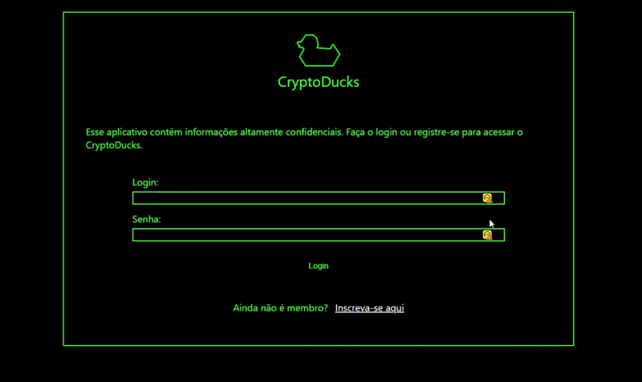

# Frontend Authorization Demo

## Live Demo

## Preview

## Project Overview

Frontend Authorization Demo is a React-based web application that demonstrates authentication and authorization flows, including user registration, login, and protected routes. It uses JWT tokens for session management and React Context API for global state management, avoiding prop drilling across components.

## Features

- User registration and login
- JWT-based authentication
- Protected routes for authenticated users
- Anonymous routes (redirects logged-in users away from login/register pages)
- Global auth state management with React Context API
- Automatic session restoration via token validation on page load
- Sign out functionality

## Tech Stack

- React — UI library
- React Router DOM — client-side routing
- Vite — build tool and dev server
- React Context API — global state management
- JWT — authentication tokens
- CSS Modules — component-level styling

## Project Status

✅ This project was completed as part of a front-end learning process.
Future improvements may include performance optimization and code modularization.

## Prerequisites

- Node.js v18 or higher
- npm v9 or higher
- A running instance of the backend API

## Installation & Setup

- Clone the repository
  bashgit clone https://github.com/your-username/frontend-authorization-demo.git

- Navigate to the project directory
  bashcd frontend-authorization-demo

- Install dependencies
  bashnpm install

## Running the Project

- npm run dev
  The app will be available at http://localhost:3000

## Project Structure

frontend-authorization-demo/
├── public/
├── src/
│ ├── assets/
│ ├── components/
│ │ ├── styles/
│ │ ├── App.jsx
│ │ ├── DuckCard.jsx
│ │ ├── DuckList.jsx
│ │ ├── Ducks.jsx
│ │ ├── Login.jsx
│ │ ├── Logo.jsx
│ │ ├── MyProfile.jsx
│ │ ├── NavBar.jsx
│ │ ├── ProtectedRoute.jsx
│ │ └── Register.jsx
│ ├── contexts/
│ │ └── AppContext.jsx
│ ├── utils/
│ │ ├── api.js
│ │ ├── auth.js
│ │ ├── data.js
│ │ └── token.js
│ ├── index.css
│ └── main.jsx
├── index.html
├── package.json
└── vite.config.js

## What I Learned

Through this project, I deepened my understanding of React's Context API and how it solves the prop drilling problem in component trees. I learned how to create a context, wrap the application with a Provider, and consume values using the useContext hook. I also reinforced my knowledge of JWT-based authentication flows, protected routing strategies, and how to restore user sessions automatically on page load.

## Contributing

- Contributions are welcome! If you'd like to contribute, please follow these steps:
  Fork the repository
  Create a new branch (git checkout -b feature/your-feature-name)
  Commit your changes (git commit -m 'Add some feature')
  Push to the branch (git push origin feature/your-feature-name)
  Open a Pull Request

## Author 👤

- GitHub: https://github.com/RodrigoMZanetti
- LinkedIn: https://www.linkedin.com/in/rodrigomaturanozanetti/
